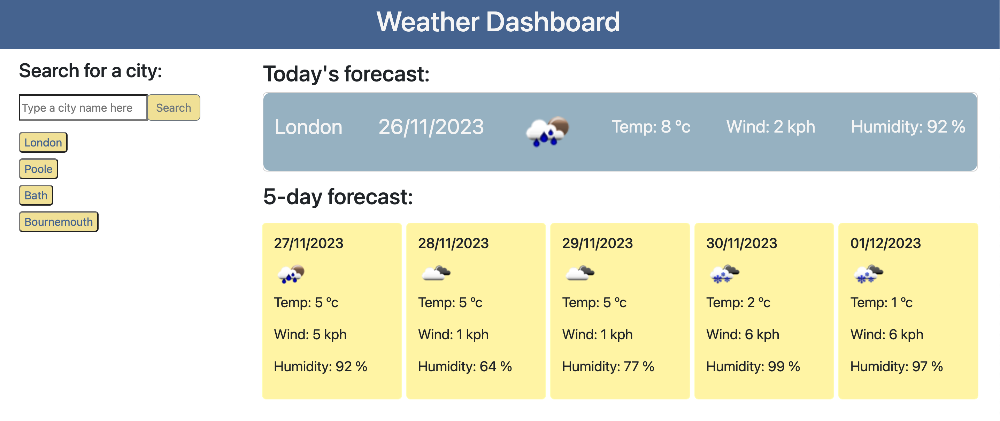

# Weather Dashboard

## Description

The aim is to provide a weather dashboard that runs in the browser to display user-defined data retrieved from Open Weather Map (https://openweathermap.org/).

All dates are retrieved from day.js and displayed in a user-friendly format.

The names of cities searched are saved into local storage so that the data persists when the page is reloaded.

It has a clean and polished user interface that is responsive, ensuring that it adapts to multiple screen sizes.

The project involved updating the HTML and CSS code and writing the JavaScript code to give the application its functionality, with attention paid to the use of day.js and the retrieval of data from a third-party API.

## Installation

n/a

## Usage

The user can enter the name of a city in the search box and click 'search'.

The relevant data for that city is then displayed, with the current weather conditions shown at the top and the 5-day forecast shown underneath.

Each time a city name is searched, a button appears under the main search box, with the name of that city. The user can then click any of these buttons at a later point to view again the weather data for that city.

All search history buttons will persist when the page is reloaded.

Screenshot: 
Website: https://louise-elliott-work.github.io-weather-dashboard

## License

This project is MIT licensed.

MIT License

Copyright (c) 2023 louise-elliott-work

Permission is hereby granted, free of charge, to any person obtaining a copy
of this software and associated documentation files (the "Software"), to deal
in the Software without restriction, including without limitation the rights
to use, copy, modify, merge, publish, distribute, sublicense, and/or sell
copies of the Software, and to permit persons to whom the Software is
furnished to do so, subject to the following conditions:

The above copyright notice and this permission notice shall be included in all
copies or substantial portions of the Software.

THE SOFTWARE IS PROVIDED "AS IS", WITHOUT WARRANTY OF ANY KIND, EXPRESS OR
IMPLIED, INCLUDING BUT NOT LIMITED TO THE WARRANTIES OF MERCHANTABILITY,
FITNESS FOR A PARTICULAR PURPOSE AND NONINFRINGEMENT. IN NO EVENT SHALL THE
AUTHORS OR COPYRIGHT HOLDERS BE LIABLE FOR ANY CLAIM, DAMAGES OR OTHER
LIABILITY, WHETHER IN AN ACTION OF CONTRACT, TORT OR OTHERWISE, ARISING FROM,
OUT OF OR IN CONNECTION WITH THE SOFTWARE OR THE USE OR OTHER DEALINGS IN THE
SOFTWARE.